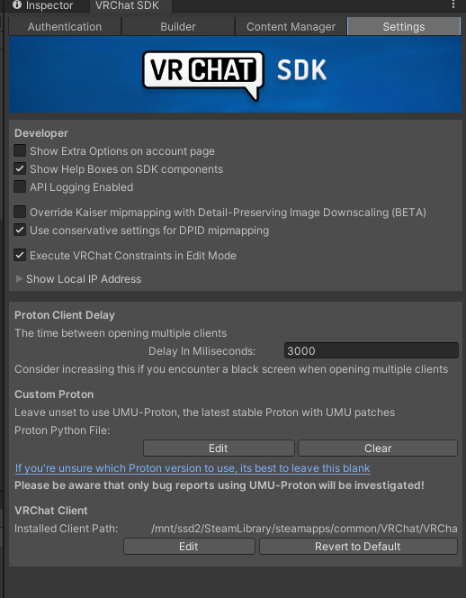

# LinuxPls
"Linux Please", a Harmony patch that adds Linux support to the VRChat Worlds SDK.

This patch addresses the following issues:
- Build and test failing to open VRChat
- Build and test crashing silently
- VRChat path not automatically being detected
- Black screen when testing multiple clients

> [!WARNING]
> This tool modifies the VRChatSDK, which is [against the terms of service.](https://hello.vrchat.com/legal#:~:text=or%20attempt%20to%20make%20any%20modification%20to%20any%20portion%20of%20the%20Platform)\
> [Please vote for an official solution on the Canny.](https://feedback.vrchat.com/sdk-bug-reports/p/add-proton-support-to-the-sdk-for-local-tests)

# Usage
1. Install `umu-launcher` from your distributions package manager
2. Install the patch into a project in your preferred way
    - Using ALCOM
        1. Add this package to ALCOM using [the website](https://peri-perihelion.github.io/LinuxPls)
        2. Install the package with ALCOM
    - Manually
        1. Download the unitypackage from [Releases](https://github.com/peri-perihelion/LinuxPls/releases)
        2. Install the unitypackage by dragging and dropping onto your project window

Additional settings (such as targeting a specific Proton version) are avaliable in the VRChat SDK Settings tab.

## Special Thanks
- [BeffudledLabs LinuxVRChatSDKPatch](https://github.com/BefuddledLabs/LinuxVRChatSDKPatch), for creating the patch that this is based on.
- [Bartkk0's VRCSDKonLinux](https://github.com/Bartkk0/VRCSDKonLinux), which laid the ground work for patching the SDK with Linux support.
